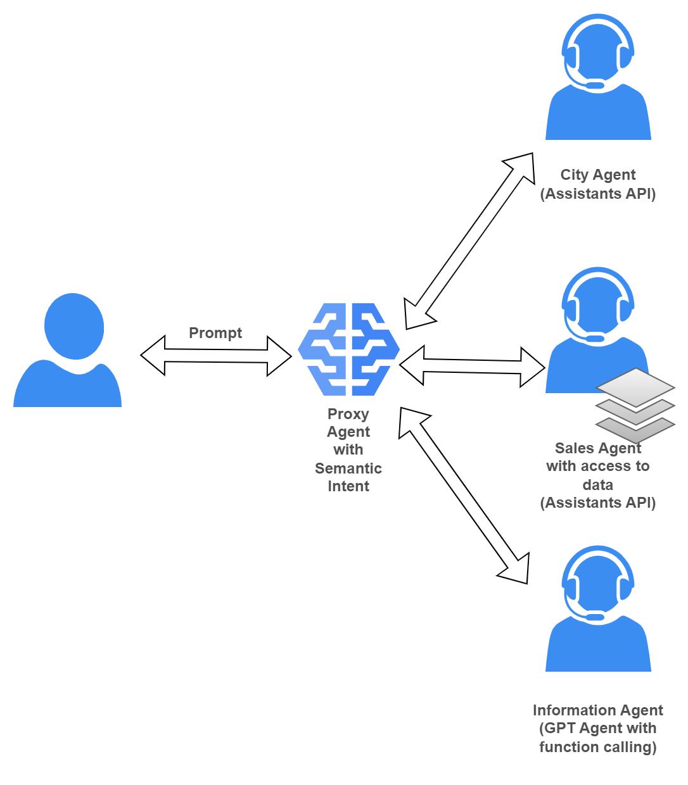

# Three Agent Copilot with Agent Proxy

This is a sample of three Assistants being used as agents in a complex Copilot solution.

## Diagram

## Agents

- **City Agent:** this agent is implemented with an Assistants API that can provide city information.
- **Sales Agent:** this ageint is implemented with an Assistants API that can perform calculations and can provide the user information customer, sellers, customer orders, and inventory.
- **Information Agent:** this ageint is implemented with GPT with Function Calling and can provide.

## Orchestration

- **Agent Proxy:** This agent coordinates which agent to call depending on user's intent.

## Possible messages handling options

1. No handling: a la LLM model
2. Manual handling: user writes the logic to coordinate messages between two agent
3. Hybrid: One agent keeps state the other just used as LLM
